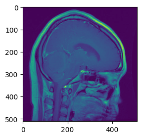

# Brain Tumor MRI Dataset - Data Exploration Summary

## 1. Dataset Overview

- Source: Local dataset (originally from [Kaggle](https://www.kaggle.com/datasets/masoudnickparvar/brain-tumor-mri-dataset) / [HuggingFace](https://huggingface.co/datasets/Simezu/brain-tumour-MRI-scan?utm_source=chatgpt.com))
- Total images: 7,023
- Number of classes: 4

---

## 2. Training and Testing Data

- Training set: 5,712 images
- Testing set: 1,311 images

### Images per class (Training)

- glioma: 1321
- meningioma: 1339
- notumor: 1595
- pituitary: 1457

### Images per class (Testing)

- glioma: 300
- meningioma: 306
- notumor: 405
- pituitary: 300

---

## 3. Data Exploration

- Random Image Samples: Visualized 3 random images per class

- Image Details:
  

  1. Image size: (512, 512)
  2. Image mode: L
  3. Image format: JPEG  
   
- Image Size Distribution: Histogram shows variation in width and height
  

- Class Balance: Training and Testing set are slightly imbalanced

---

## 4. Insights / Notes

- Images will need resizing to a consistent size for model training  
- Data augmentation may be applied to address class imbalance  
- All images are RGB, no grayscale images found  
- No corrupted files detected

---
